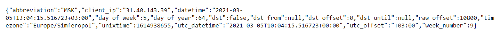

МИНИСТЕРСТВО НАУКИ  И ВЫСШЕГО ОБРАЗОВАНИЯ РОССИЙСКОЙ ФЕДЕРАЦИИ 
Федеральное государственное автономное образовательное учреждение высшего образования 
"КРЫМСКИЙ ФЕДЕРАЛЬНЫЙ УНИВЕРСИТЕТ им. В. И. ВЕРНАДСКОГО" 
ФИЗИКО-ТЕХНИЧЕСКИЙ ИНСТИТУТ 
Кафедра компьютерной инженерии и моделирования

 
<h3 align="center">Отчёт по лабораторной работе № 1  по дисциплине "Программирование"</h3>
  

студента 1 курса группы ПИ-б-о-202(2) 
Синчак Сергей Сергеевич 
направления подготовки 09.03.04 "Программная инженерия"

  
<table>
<tr><td>Научный руководитель  старший преподаватель кафедры  компьютерной инженерии и моделирования</td>
<td>(оценка)</td>
<td>Чабанов В.В.</td>
</tr>
</table>
  

Симферополь, 2020

 

## Постановка задачи
---

Разработать сервис предоставляющий данные о погоде в городе Симферополе на момент запроса.  В качестве источника данных о погоде используйте: *http://openweathermap.org/*. В состав сервиса входит: серверное приложение на языке С++ и клиентское приложение на языке Python.

Серверное приложение (далее Сервер) предназначенное для обслуживания клиентских приложений и минимизации количества запросов к сервису openweathermap.org. Сервер должен обеспечивать возможность получения данных в формате JSON и виде html виджета (для вставки виджета на страницу будет использоваться iframe).

Клиентское приложение должно иметь графический интерфейс отображающий сведения о погоде и возможность обновления данных по требованию пользователя.

## Выполнение работы
---
### 1. API key полученный на сервисе [openweathermap.org](http://openweathermap.org/).

Для получения API ключа зашел на сайт *http://openweathermap.org/* и регистрировался. В аккаунте перешёл во вкладку [*API keys*](https://home.openweathermap.org/api_keys) и скопировал представленный ключ. Полученный ключ ниже:
>efb20d329caaf24c185748f1042f4a17

### 2. Запрос составленный в пункте I.7.
Для составления запроса к сервису изучил [*пример на том же сайте*](https://openweathermap.org/api/one-call-api#current) и при помощи сайта [*latitudelongitude.org*](https://latitudelongitude.org) нашёл широту и долготу. Составленный запрос ниже:
>https://api.openweathermap.org/data/2.5/onecall?lat=44.95719&lon=34.11079&exclude=hourly&appid=efb20d329caaf24c185748f1042f4a17

В результате сервис дал ответ в формате JSON.

Для лучшего чтения полученного JSON ответа можно воспользоваться сервисом [*JSON Viewer*](https://codebeautify.org/jsonviewer).

### 3. Запрос составленный в пункте II.
Для составления запроса сервиса [*worldtimeapi.org*](http://worldtimeapi.org) я изучил формат оформления запроса на [*том же сайте*](http://worldtimeapi.org/pages/schema). Составленный запрос ниже:
>http://worldtimeapi.org/api/timezone/Europe/Simferopol

В результате я получил ответ в формате JSON.

### 4. Полный исходный код серверного приложения.
### 5. Полный исходный код клиентского приложения.
### 8. Скриншот графического интерфейса клиентского приложения.
### 7. Скриншот браузера с загруженными виджетом.