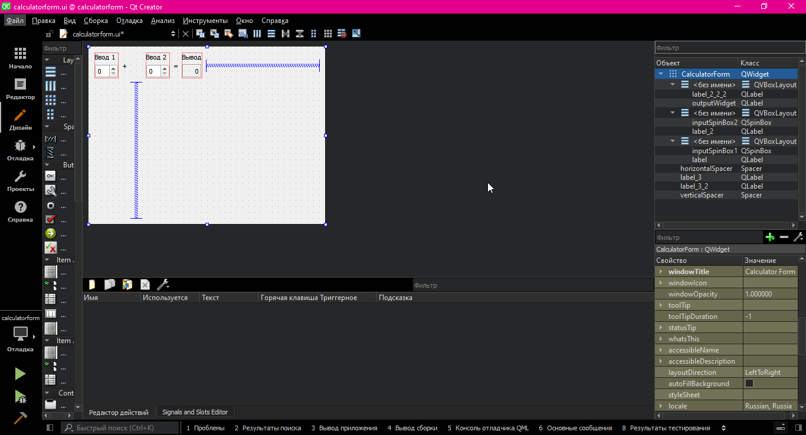

МИНИСТЕРСТВО НАУКИ  И ВЫСШЕГО ОБРАЗОВАНИЯ РОССИЙСКОЙ ФЕДЕРАЦИИ 
Федеральное государственное автономное образовательное учреждение высшего образования 
"КРЫМСКИЙ ФЕДЕРАЛЬНЫЙ УНИВЕРСИТЕТ им. В. И. ВЕРНАДСКОГО" 
ФИЗИКО-ТЕХНИЧЕСКИЙ ИНСТИТУТ 
Кафедра компьютерной инженерии и моделирования

 
<h3 align="center">Отчёт по лабораторной работе № 4  по дисциплине "Программирование"</h3>
  

студента 1 курса группы ПИ-б-о-202(2) 
Синчак Сергей Сергеевич 
направления подготовки 09.03.04 "Программная инженерия"

  
<table>
<tr><td>Научный руководитель  старший преподаватель кафедры  компьютерной инженерии и моделирования</td>
<td>(оценка)</td>
<td>Чабанов В.В.</td>
</tr>
</table>
  

Симферополь, 2020

 

## Постановка задачи
---

Настроить рабочее окружение, для разработки программного обеспечения при помощи Qt и IDE Qt Creator, а также изучить базовые возможности данного фреймворка.

## Выполнение работы
---

#### Задание 1.
1. Сначала я скачал и установил Qt Creator [с официального сайта](https://www.qt.io)
2. Далее в разделе **Примеры** я нашел проект **Calculator Form Example**.
3. Щелкнув по проекту выбрал версию под **Desktop** после чего щёлкнул по кнопке **Редактор**
4. Скриншот ниже:

#### Задание 2.

1. Как изменить цветовую схему (оформление) среды?
2. Как закомментировать/раскомментировать блок кода средствами Qt Creator? Имеется ввиду комбинация клавиш или пункт меню.
3. Как открыть в проводнике Windows папку с проектом средствами Qt Creator?
4. Какое расширение файла-проекта используется Qt Creator? Может быть несколько ответов.
5. Как запустить код без отладки?
6. Как запустить код в режиме отладки?
7. Как установить/убрать точку останова (breakpoint)?

#### Задание 3.

1. Создал приложение без Qt.
2. После того как скопировал код из материалов для лабораторной, переключил режим сборки в режим **Отладка**
3. Установил точки остановки на 6, 7 и 8.
4. Значение переменных ниже:
> 6: i = 0; d = 9.42124e-318;
> 7: i = 5; d = 9.42124e-318;
> 8: i = 5; d = 5;